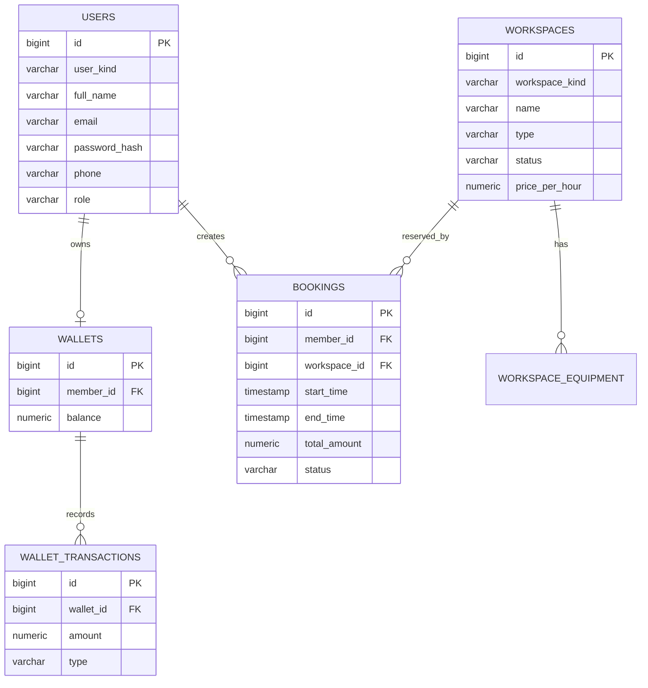

# Database Draft

```mermaid
erDiagram
  USERS ||--o| WALLETS : owns
  USERS ||--o{ BOOKINGS : creates
  WORKSPACES ||--o{ BOOKINGS : reserved_by
  WORKSPACES ||--o{ WORKSPACE_EQUIPMENT : has
  WALLETS ||--o{ WALLET_TRANSACTIONS : records

  USERS {
    bigint id PK
    varchar user_kind
    varchar full_name
    varchar email
    varchar password_hash
    varchar phone
    varchar role
  }

  WORKSPACES {
    bigint id PK
    varchar workspace_kind
    varchar name
    varchar type
    varchar status
    numeric price_per_hour
  }

  BOOKINGS {
    bigint id PK
    bigint member_id FK
    bigint workspace_id FK
    timestamp start_time
    timestamp end_time
    numeric total_amount
    varchar status
  }

  WALLETS {
    bigint id PK
    bigint member_id FK
    numeric balance
  }

  WALLET_TRANSACTIONS {
    bigint id PK
    bigint wallet_id FK
    numeric amount
    varchar type
  }
```
