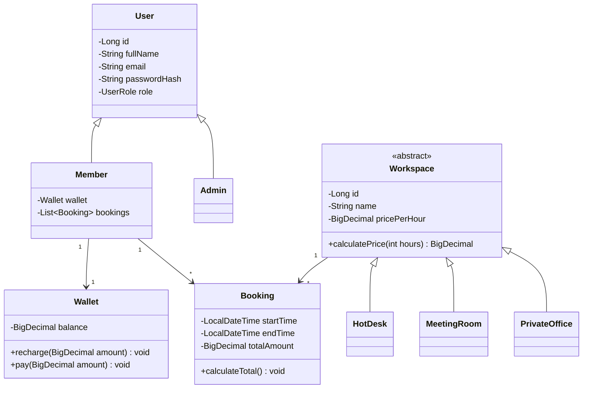

# Class Diagram Draft

```mermaid
classDiagram
  class User {
    -Long id
    -String fullName
    -String email
    -String passwordHash
    -UserRole role
  }

  class Member {
    -Wallet wallet
    -List~Booking~ bookings
  }

  class Admin

  class Workspace {
    <<abstract>>
    -Long id
    -String name
    -BigDecimal pricePerHour
    +calculatePrice(int hours) BigDecimal
  }

  class HotDesk
  class MeetingRoom
  class PrivateOffice

  class Booking {
    -LocalDateTime startTime
    -LocalDateTime endTime
    -BigDecimal totalAmount
    +calculateTotal() void
  }

  class Wallet {
    -BigDecimal balance
    +recharge(BigDecimal amount) void
    +pay(BigDecimal amount) void
  }

  User <|-- Member
  User <|-- Admin
  Workspace <|-- HotDesk
  Workspace <|-- MeetingRoom
  Workspace <|-- PrivateOffice
  Member "1" --> "1" Wallet
  Member "1" --> "*" Booking
  Workspace "1" --> "*" Booking
```
